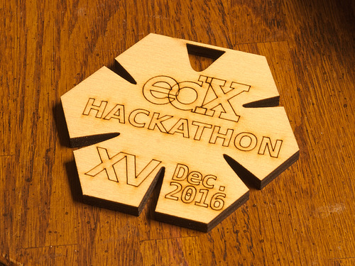

Trinkets for an event at the edX office.  Originally designed for the
`2016 December hackathon <https://openedx.atlassian.net/wiki/display/OPEN/Hackathon+XV>`_.

Build Instructions
==================

1. install inkscape: https://inkscape.org/.
2. alter design by opening ``hackathon_badges.svg``.
3. make sure you only edit the upper left badge.  The rest are parametric clones, so they will automatically update themselves.
4. save and quit inkscape.
5. run ``make``.
6. check in the build directory for each layer, make sure they look good (open them in a web browser or inkscape).

Cutting Instructions
====================

We cut these using the Epson CNC laser cutter at the MIT Hobby Shop.  The
machine was configured to accept data from CorelDraw, so we did the following
things to get it to work with our files:

1. on the computer, open CorelDraw.
2. new document (verify the dimensions are 28"x40").
3. File -> Import -> select ``hackathon_badges_profile.svg``.
4. File -> Import -> select ``hackathon_badges_text.svg``.
5. align the layers correctly.
6. select the profile layer and make sure the outline is of thickness "hairline" and color is green (#00ff00).
7. select the text layer and make sure the outline is of thickness "hairline" and color is red (#ff0000).
8. File -> Print.
9. Properties -> Color Mapping (?)
10. enable color mapping using the checkbox
11. delete all the colors except for red and green
12. give red a speed of 50%, and power of 50%.
13. give green a speed of 5%, and power of 100%.
14. make sure red is first, then green is second.
15. click OK to get out of the properties dialog
16. click OK to get out of the print dialog

Now verify that the CNC data was sent to the machine.  The steps that follow
are manual labor steps:

1. turn on the vent fan.
2. open the air assist valve.
3. insert wood.
4. turn on the laser.
5. press GO.

Don't walk away, stay in case there is a fire.
